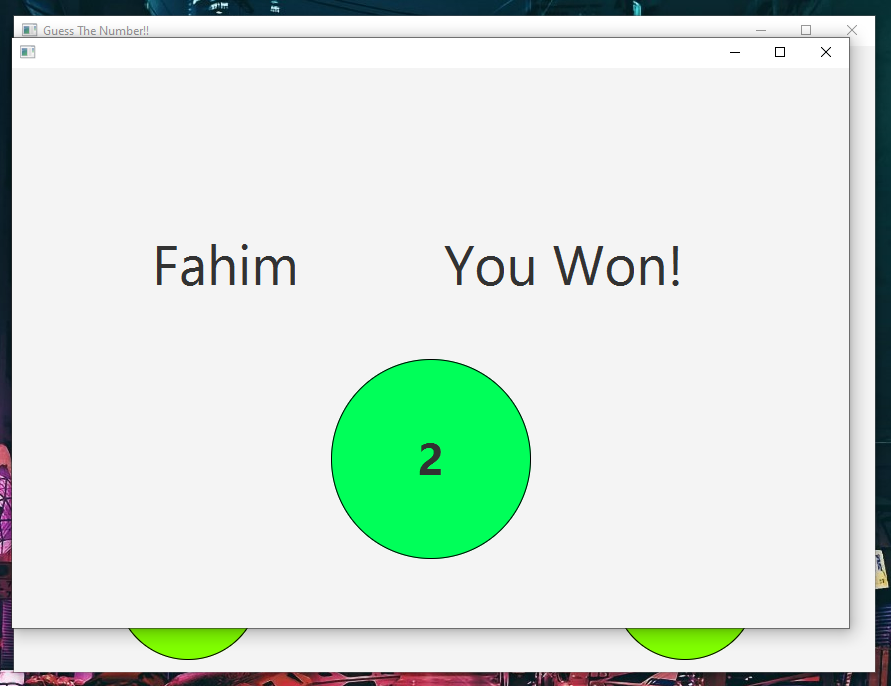

# Number Guessing Game

This is a simple number guessing game. The computer will pick a random number between 1 and 4. 
The player will then try to guess the number. 
After each guess, the computer will determine if the guess is right or wrong. 
The player wins if they can guess the number within 2 attempts, and if the user fails to do so within the given 2 attempts,
then the user loses. If the user submits their name, then the program also shows the user's name in the output screen.

**The updated and the default branch is the `production` branch.**

## Some screenshots

## How to run

1. Clone the repository
2. You can simply run the game by launching the `jar` file. You can find the `jar` file in the `javafx-guessing-number-game\javafx-guessing-number-game\out\artifacts\GuessingNumberGame_jar` directory.
3. If you want to see the code and run it, you can open the project in IntelliJ IDEA. You can find the project in the `javafx-guessing-number-game\javafx-guessing-number-game` directory.
4. This contains three java classes. The `Main` class is only for building the artifact.
5. The main class is the `MainGameScreen` class. That has also been added to the `pom.xml` file.
6. THe secondary class is the `VerdictScreen` class which contains the output result screen.

## How to play

* Simple download the [jar](out/artifacts/GuessingNumberGame_jar/GuessingNumberGame.jar) file and run it.

